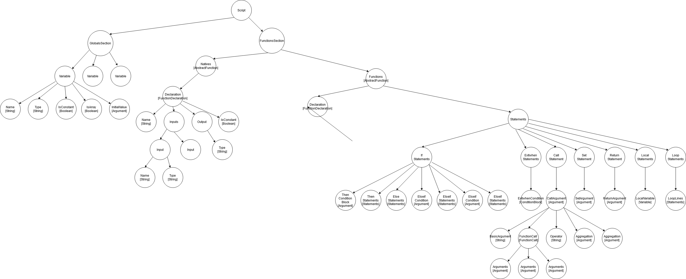

# JAST

This is a multi-purpose and open-source tool for modifying JASS Script files.

### Features

- Code merging: given two war3map.j files, logically merges them together to contain the functionality of both.
- Code merging with de-duplication: fix annoying variable collision problems! This feature assigns randomized, unique names to the variables/functions for the script file you are merging with.
- Comes with NZCP.j, JJCP.j, and FAI.j packaged with it. These can be used natively without downloading anything.
- Basic syntax checking: makes sure there are no obvious compile errors in the script file.
- Variable and function renamer: rename anything in the file without any of the typical problems that a find/replace would introduce.
- String Hash calculation and breaker: find StringHash of a plaintext string, and brute force a hashed value
- MPQ Extraction
- Clean rawcode generation: Create rawcodes from object files
- Syntax checking: Uses PJASS for advanced syntax checking
- Un-hexing code: No more annoying $HEX errors.
- Script formatting: Indents code to the appropriate values

### Possible Planned Features

- GUI -> JASS Conversion: Code written in GUI is always inefficient due to use of Condition functions and BlizzardJass functions. This tool can convert GUI code into efficient JASS code.
- Auto detect possible optimizations, for example looping rather than copy/pasted lines of code
- Custom command helper: write some boilerplate code for a custom command for you, and merge it into the map automatically
- WTS String Merging: Combines the war3map.wts file back into the war3map.j file so that you can see what the strings are.
- Logical Single Player Detection: Attempts to search for Single Player conditions based on some given user inputs
- Logical Anticheat Detection: Attempts to search for anti-cheats
- Deobfuscate: Perform some basic code de-obfuscation in order to make it more readable. Applies some basic logic rules.
- Integrate with war3map.wtg writer to restore GUI triggers from script
- And more!

### Advantages over other tools

- Lightweight: Comes as a single .jar file with NZCP/JJCP/FAI packaged with it.
- Portable: Any computer with Java installed can run this program. No redistributable, DLLs, or WC3 Install is required.
- Programmatically robust: Uses a Abstract Syntax Tree internally, which is how modern IDEs parse their code. Written with test-driven design, and tested on real war3map.j files. This sort of parsing will not be confused by things like comments and fake main methods.
- Open source: If you want to know how something is done, just check the source code.
- Simple, clean, easy-to-use user interface.

### Feedback & Contributions

If you discover any maps that this tool fails on or messes up the logic of, please let me know and I'll write a test case around it and then fix up the syntax tree.

If there are any features you think would be nice to have, please let me know.

Feel free to contribute with a pull request if you want. All contributions are welcome. The primary way to gauge functionality is by Cucumber unit tests. If a case is encountered that breaks the program, it must be added as a unit test case and then fixed.

### Syntax Tree

This is a diagram of the complete syntax tree, if you're interested. You may notice heavily nested structures. This is due to the nature of parsing programming languages.
(download and zoom in. it is very large.)
